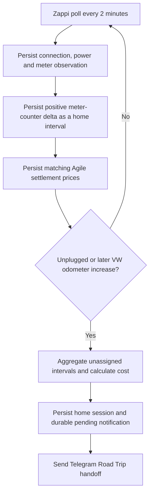
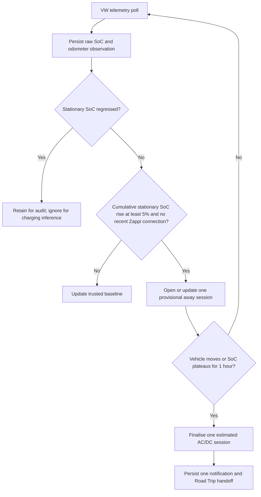

# Brontes

A deterministic, local-first charging ledger for a Volkswagen ID.Buzz. Brontes
observes and reconciles charging; Hermes interprets requests and delivers
notifications.

> **Hermes interprets and communicates. Brontes decides, records and reconciles.**

## Current implementation

The implemented home-charging path is read-only with respect to the vehicle and
MyEnergi:

- Volkswagen telemetry is read through the existing CarConnectivity VW EU Data
  Act CLI.
- MyEnergi Zappi telemetry is read with Digest authentication using the
  `myenergi_api` entry in `~/.netrc`.
- Zappi meter-counter deltas are persisted as home charging intervals in a
  local SQLite ledger.
- Public Octopus Agile half-hour settlement prices are stored alongside those
  intervals and used for cost calculation.
- Budget Charge pauses remain separate intervals in one unassigned logical
  home session.
- A session is finalised after the Buzz is unplugged from Zappi or a fresh VW
  observation reports that its odometer has increased.
- Finalisation queues a durable notification. The next provider poll sends it
  with `hermes send --to telegram`; it is marked delivered only after Hermes
  reports success.
- Road Trip entries use the vehicle name `Volkswagen ID.Buzz GTX`, a
  Europe/London local `YYYY-MM-DD HH:MM` timestamp, and an HTTPS handoff that
  Telegram can open.

The service does not currently control Volkswagen, Zappi, MyEnergi schedules,
or Telegram directly. It does not use an LLM in its decision path.

## Charging-session lifecycles

### Home charging



Budget Charge pauses and resumes retain intervals in the same unassigned logical
home session. A stopped charge or an SoC of 80% is deliberately **not** a
completion trigger: a Budget Charge session may resume after a price gap and the
configured vehicle limit may be above 80%. If Octopus pricing is unavailable,
finalisation remains pending and subsequent polls retry it; no unpriced session
is silently sent.

### Away charging



Away inference rejects stationary regressive readings — which VW can return
intermittently — so a stale SoC cannot become the baseline for a phantom charge.
A qualifying rise opens a provisional session only after two increasing VW SoC
observations; later increases update it rather than generating more
notifications. The session finalises only after a credible boundary: vehicle
movement or a one-hour plateau in SoC.

## Polling and persistence

The installed Brontes executable is the single entry point for scheduled and
interactive operations:

```bash
brontes poll zappi
brontes poll vw
brontes reconcile
brontes status
```

For a source checkout, install the project into its local virtual environment:

```bash
python3 -m venv .venv
.venv/bin/python -m pip install --editable .
```

`poll zappi` and `poll vw` read one provider, apply the shared deterministic
workflow and retry pending notification delivery. `reconcile` retries a
previously requested session closure without contacting either provider. All
three commands emit a compact JSON result on standard output. The former
`scripts/poll.py` is retained only as a compatibility shim and contains no
workflow logic.

The current host installation runs these through local scheduler jobs:

| Provider | Frequency | Behaviour |
| --- | ---: | --- |
| Zappi | every 2 minutes | Read telemetry, process home intervals, retry finalisation and notifications. |
| VW EU Data Act | every 15 minutes | Read vehicle telemetry, close eligible home sessions after odometer movement, retry notifications. |

Both jobs are read-only against their providers. The host scheduler invokes `brontes poll zappi` and `brontes poll vw` through
minimal wrappers. Scheduler configuration is host-specific and intentionally
not committed to this public repository.

SQLite defaults to `data/brontes.sqlite3`; it is ignored by Git. SQLite is the
source of truth for observations, intervals, costs, sessions and notification
delivery state. This makes poll retries and restarts idempotent provided the
same ledger is retained.

For any persistent deployment, set `BRONTES_DATABASE_PATH` to one **absolute**
canonical path in every CLI/scheduler wrapper. Do not rely on the process
working directory: a relative default can create separate ledgers for an
interactive shell and a scheduler. The current host wrappers use the project
ledger at `/home/hermes/workspace/projects/brontes/data/brontes.sqlite3`.

## Configuration and credentials

Brontes uses Python 3.13+ and only the standard library. Credentials are never
committed or read from configuration files in this repository.

| Variable | Default | Used by |
| --- | --- | --- |
| `BRONTES_DATABASE_PATH` | `data/brontes.sqlite3` | API and poll entry point |
| `BRONTES_HOST` | `127.0.0.1` | Local HTTP API |
| `BRONTES_PORT` | `8088` | Local HTTP API |
| `BRONTES_HERMES_NOTIFICATION_URL` | unset | Optional HTTP notification bridge for the local API |
| `BRONTES_OCTOPUS_PRODUCT_CODE` | `AGILE-24-10-01` | Poll entry point |
| `BRONTES_OCTOPUS_TARIFF_CODE` | `E-1R-AGILE-24-10-01-B` | Poll entry point |
| `BRONTES_TELEGRAM_TARGET` | `telegram` | Poll entry point |
| `BRONTES_CARCONNECTIVITY_CLI` | host installation default | VW poll entry point |
| `BRONTES_CARCONNECTIVITY_CONFIG` | host installation default | VW poll entry point |
| `BRONTES_CARCONNECTIVITY_TOKEN` | host installation default | VW poll entry point |
| `BRONTES_CARCONNECTIVITY_CACHE` | host installation default | VW poll entry point |

The MyEnergi adapter requires a `~/.netrc` machine named `myenergi_api`, where
the login is the hub identifier and the password is the MyEnergi API key. Do
not copy, print or commit its values. The CarConnectivity VW configuration and
its token/cache remain outside the Brontes repository.

The documented default Agile tariff is the current configured tariff for this
installation. Set the product and tariff environment variables if the account's
Agile tariff changes; incorrect tariff configuration produces incorrect costs.

## Road Trip handoff

Road Trip does not reliably open `desroadtrip://` links directly from Telegram.
Brontes instead generates an HTTPS link to the static GitHub Pages handoff:

```text
https://darranshepherd.github.io/brontes/roadtrip/
```

The Road Trip callback is Base64URL encoded in the URL fragment. Fragments are
not sent to GitHub Pages, so charge values and callback data are not published
in page requests or server logs. The static page validates that a decoded value
is a Road Trip `x-callback-url` before opening it locally.

The callback includes:

- `vehicle=Volkswagen%20ID.Buzz%20GTX`;
- authoritative ledger energy, cost and odometer values;
- the session closure timestamp converted to `Europe/London`; and
- `Home · Zappi · Agile` provenance notes.

The Pages workflow is in `.github/workflows/deploy-pages.yml`; GitHub Pages
must use **Settings → Pages → Build and deployment → GitHub Actions**.

## Optional local HTTP API

Run the loopback API with:

```bash
brontes serve
```

It listens on `127.0.0.1:8088` by default. It is intentionally optional and
does not start the provider pollers. Hermes should use the CLI for normal local
status reads and controlled operations until a richer API is justified.

| Endpoint | Current behaviour |
| --- | --- |
| `GET /health` | Reports service status and whether the optional HTTP notification bridge is configured. |
| `GET /status` | Reports the count of pending notifications. |
| `POST /observations/zappi` | Records a validated, already-derived home interval. |
| `POST /prices/agile` | Records an Agile settlement price. |
| `POST /reconcile/odometer` | Reconciles eligible unassigned home intervals at a supplied odometer reading. |
| `POST /notifications/deliver` | Delivers pending notifications through the optional HTTP bridge, if configured. |

The API does not yet expose raw provider polling, detailed status/health, manual
charge reports, away charging, or MyEnergi schedule operations.

## Safety, limitations and next work

- Persisted observations and intervals are committed before sessions and
  notifications are derived.
- Notification failure does not change charging or accounting state; delivery
  remains pending for a later poll.
- Counter deltas are allocated proportionally across their observation window
  when calculating half-hour Agile costs. The calculation is therefore bounded
  by the 2-minute Zappi polling cadence rather than exact sub-minute metering.
- Away charging is inferred from a cumulative stationary VW SoC rise of at least
  5 percentage points while no home-Zappi connection is recorded. A regressive
  stationary SoC observation is retained for audit but excluded from inference.
  A qualifying rise opens one provisional session only after two increasing VW
  SoC observations, which is finalised only after the vehicle moves or SoC has
  plateaued for one hour. Energy is an estimate from
  the Buzz GTX's 86 kWh battery; entries explicitly retain that provenance. A
  rise of at least 20 points within an hour is classified as DC; other qualifying
  rises are AC. AC uses the current UK Ofgem national-average Direct Debit cap
  rate (26.11p/kWh for 1 July–30 September 2026); DC uses the configured
  £0.75/kWh assumption. The `reconcile-away` workflow is idempotent and is
  intended for controlled historical backfills.
- Manual reconciliation and control paths are not yet implemented.
- The local API binds to loopback by default. Do not expose it publicly or
  commit credentials, token/cache files or SQLite ledger data.

See [ROADMAP.md](ROADMAP.md) for delivered work, remaining work and acceptance
criteria.

## Development

```bash
PYTHONPATH=src python3 -m unittest discover -s tests -v
python3 -m compileall -q src scripts
```
